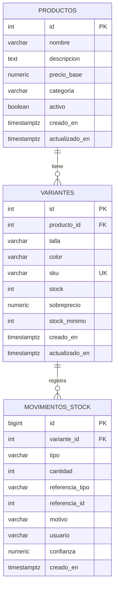

# Esquema de base de datos — Inventario

**Issue:** #5 — Diseñar esquema de base de datos de Inventario
**Responsable:** Jair Enrique Polo Chamorro
**Estado:** Propuesto (pendiente revisión de Andrés, ver sección de coordinación)

---

## 1. Resumen

El esquema tiene 3 tablas:

| Tabla | Propósito |
|---|---|
| `productos` | La prenda en general: nombre, descripción, precio base, categoría. |
| `variantes` | Cada combinación talla/color de un producto, con su propio stock y SKU. |
| `movimientos_stock` | Registro de auditoría de todo cambio de stock (venta, anulación, recepción de proveedor, ajuste manual, detección de IA). |

Es un script SQL interino de creación manual (`docs/inventario/schema.sql`), no conectado automáticamente a Docker Compose (no existe montaje `docker-entrypoint-initdb.d` en `docker-compose.yml`). Servirá de referencia cuando el equipo adopte EF Core (marcado "Pendiente Sprint 1" en `docs/guias/docker-compose.md`).

---

## 2. Diagrama entidad-relación



---

## 3. Decisiones de diseño

### 3.1 `cantidad` firmada en `movimientos_stock`

Se eligió una columna `cantidad INTEGER` con signo (positivo = entrada, negativo = salida) en vez de cantidad sin signo + una columna de dirección separada.

- El contrato de IA (`docs/requerimientos/ia.md`) ya expresa la dirección como `+1/-1` — una columna firmada es el mapeo directo, sin traducción.
- `SUM(cantidad)` por variante da el saldo neto directamente, que es lo que Análisis necesita para "stock actual" y "productos sin movimiento en 30 días" (`docs/requerimientos/analisis-dashboard.md`).
- Cantidad sin signo + dirección separada tiene riesgo de inconsistencia de datos (ej. `cantidad=5, direccion='salida'` guardado por error como `direccion='entrada'`); la columna firmada es auto-descriptiva.

### 3.2 `variante_id` obligatorio en todo movimiento

Todo movimiento (incluida `recepcion_proveedor`) referencia una variante, nunca un producto general — consistente con la regla propia de `docs/requerimientos/inventario.md`: *"Ventas siempre descuenta stock de una variante específica, nunca del producto general"*. Ver sección 5 (Coordinación con Andrés): esto no está resuelto en el contrato actual de Proveedores.

### 3.3 Columnas incluidas más allá de lo mínimo

- `variantes.stock_minimo` (default 5): resuelve la pregunta abierta de `inventario.md` sección 7 y `analisis-dashboard.md` sobre si el umbral de stock bajo debería ser configurable por variante en vez de estar fijo en el código.
- `productos.creado_en/actualizado_en` y `variantes.creado_en/actualizado_en`: auditoría estándar.

Se descartaron por ahora (se pueden agregar después sin romper el esquema):
- `movimientos_stock.stock_resultante` (snapshot del stock tras cada movimiento) — información derivable sumando movimientos, no se agrega hasta que haya una necesidad real de performance.
- `movimientos_stock.requiere_confirmacion` — la regla RN-003 de `ia.md` ("detecciones de baja confianza requieren confirmación manual") se implementará junto con la lógica real de confirmación, no solo como campo suelto.

### 3.4 Referencias suaves, no FK duras, a `venta` y `orden_compra`

`movimientos_stock.referencia_id` (+ `referencia_tipo`) apunta a `venta.id` o a `orden_compra.id` sin restricción `REFERENCES`, porque:
- Ventas todavía no persiste en Postgres (sigue en memoria, `List<Venta>` en `VentasService`).
- `ordenes_compra` es una tabla que pertenecerá al módulo Proveedores (dueño: Andrés), fuera del alcance de este esquema.

Cuando esas tablas existan, se puede evaluar agregar FKs duras.

### 3.5 `usuario` como texto libre

No existe ningún módulo de usuarios/autenticación en el repo todavía, así que `movimientos_stock.usuario` es `VARCHAR` de texto libre en vez de una FK a una tabla `usuarios`. Cuando exista autenticación, se migra a `usuario_id INTEGER REFERENCES usuarios(id)`.

### 3.6 `VARCHAR + CHECK` en vez de `ENUM` nativo

`tipo` y `referencia_tipo` usan `VARCHAR` con `CHECK` en vez de un tipo `ENUM` de Postgres, porque agregar valores a un ENUM requiere `ALTER TYPE ... ADD VALUE` y este esquema es interino pre-EF Core — más fácil de ampliar mientras el modelo de datos todavía se está afinando.

---

## 4. Tipos de movimiento

| `tipo` | Dirección | Cuándo se genera | HU / RN relacionada |
|---|---|---|---|
| `venta` | Salida (-) | Al confirmar una venta | RN-003 ventas.md, contrato Ventas→Inventario |
| `anulacion_venta` | Entrada (+) | Al anular una venta (el stock se restaura) | HU-004 ventas.md |
| `recepcion_proveedor` | Entrada (+) | Al registrar recepción de mercancía | HU-003 inventario.md, RN-002 proveedores.md |
| `ajuste_manual` | Entrada (+) o salida (-) | Ajuste por daños, pérdidas, conteo físico | HU-004 inventario.md |
| `deteccion_ia` | Entrada (+) o salida (-) | Detección automática por cámara | HU-001 ia.md, contrato IA→Inventario |

Todo movimiento queda registrado permanentemente (RN-002 inventario.md: *"Todo movimiento de stock debe quedar registrado (auditoría)"*), y `variantes.stock` nunca puede quedar negativo (RN-005, enforced con `CHECK (stock >= 0)`).

---

## 5. Coordinación con Andrés

**Pregunta abierta, sin resolver unilateralmente:**

El contrato de Proveedores (`docs/requerimientos/proveedores.md`, sección 6) dice que al registrar una recepción se envía **"ID orden, ID producto, cantidad recibida"** — a nivel de **producto**, no de variante.

Este esquema, en cambio, exige `variante_id` (NOT NULL) en **todo** movimiento, incluida la recepción, para mantener consistencia con Ventas (que sí opera a nivel de variante) y con la regla propia de Inventario de que el stock vive siempre a nivel de variante, nunca de producto general.

**Necesito tu input, Andrés:** ¿cómo va a resolver Proveedores la granularidad de variante al registrar una recepción?
- ¿La orden de compra ya desglosa cantidades por variante (talla/color), y el contrato solo lo simplificó al describirlo?
- ¿O se espera que Inventario reciba solo "ID producto + cantidad" y resuelva internamente a qué variante(s) aplica (por ejemplo, si el producto tiene una única variante, o pidiendo desglose en el momento de la recepción)?

Esto hay que definirlo antes de implementar el endpoint de recepción de mercancía, para no implementar contra una suposición (ver `docs/DECISIONES.md`, sección 6: "Contratos antes que implementación").

---

## 6. Cómo aplicar el script

```bash
docker compose up -d db
docker compose exec -T db psql -U erpuser -d erp_moda < docs/inventario/schema.sql
docker compose exec db psql -U erpuser -d erp_moda -c "\dt"
```

No se aplica automáticamente al levantar `docker compose up` — no hay volumen `docker-entrypoint-initdb.d` configurado en `docker-compose.yml` (fuera de alcance de este issue).
